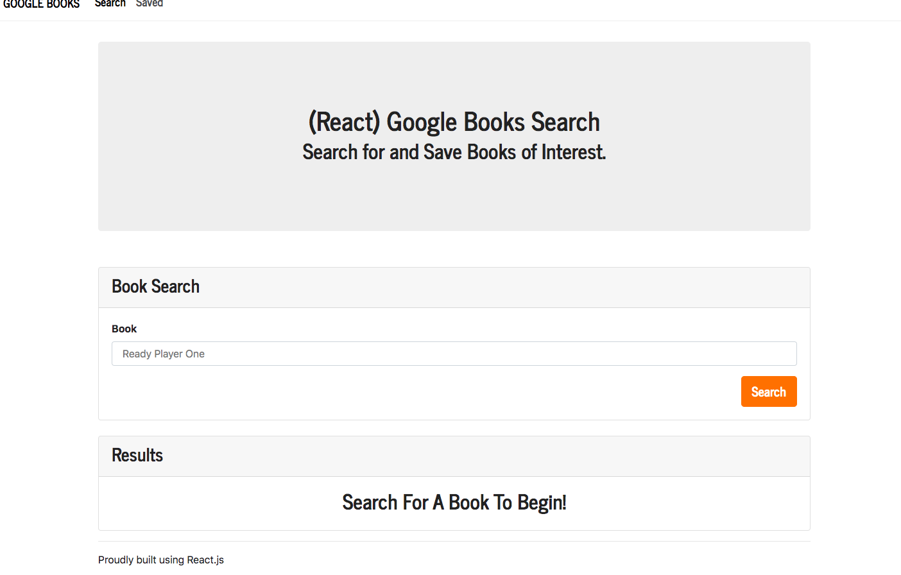
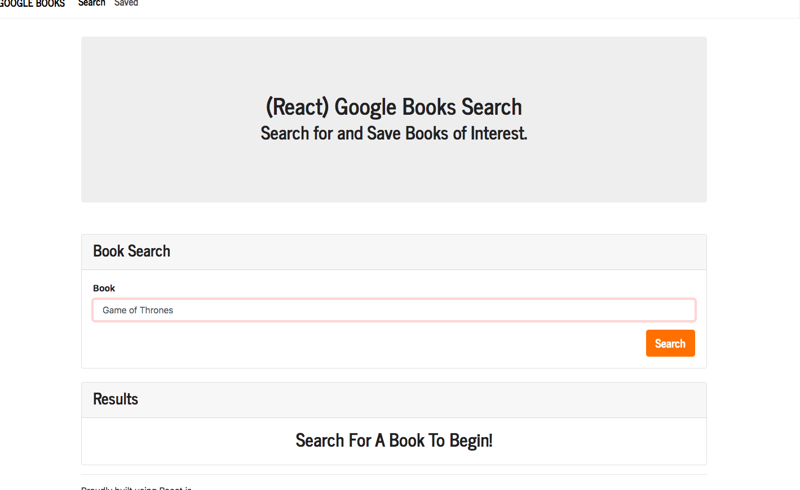
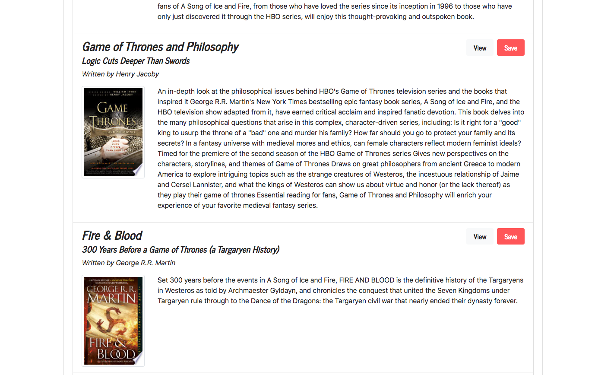
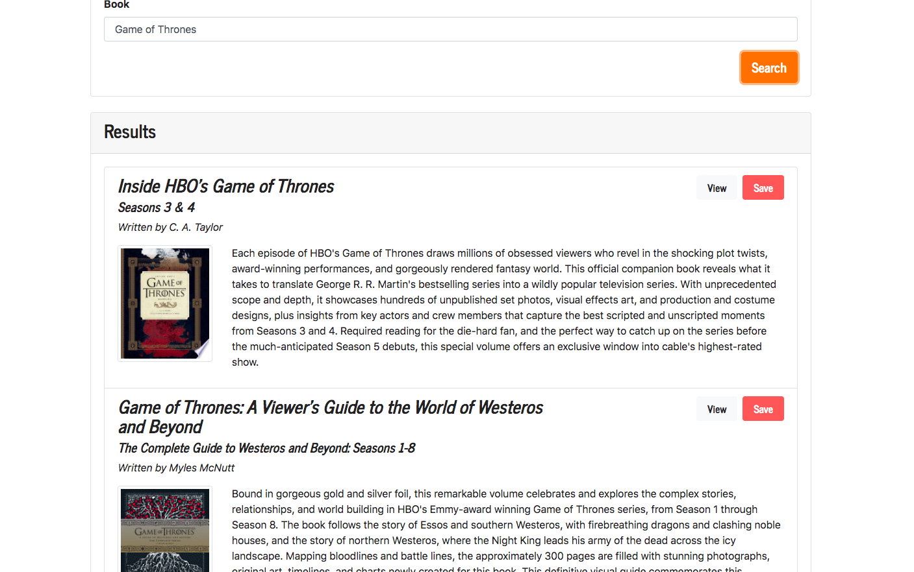
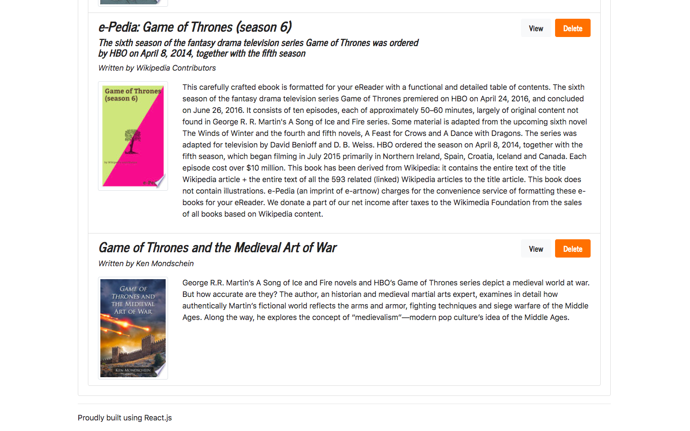
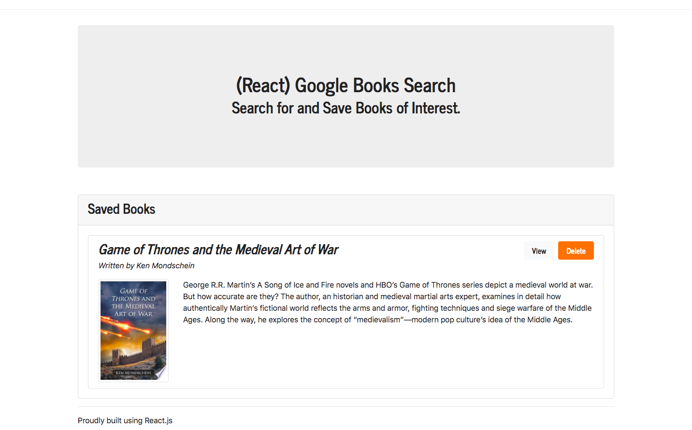

# Google-Book-Search

## Application description:

 React based Google books search app that allows users to search, save, and delete books that they selected   based off of Googles API book search. I created React components, worked with util functions, and utilized React lifecycle methods to query and display books based on user searches. I used Node, Express and MongoDB so that users can save books to review or purchase later.
 

 ## Click [here](https://google-book-search-app-finder.herokuapp.com/) for the live app. 
 
 This is the home screen:
 
 
 
 This is where the search bar is to type up what book the user is searching for:
 

  
  
 The searched results will then show a variety of books:
 
  
   
  
  The user can then click on the book and view it and see options to view the books description, price, add to cart, add to wishlist, ect:
  
     
  
  The user can also save books in the Google Book Search by clicking save and bring users to the saved books page:
  
    
  
  Users can also delete books in their saved results by clicking delete:
  
    
  
  
## Libraries and Frameworks:

- React
- Node
- Express
- MongoDB

## Email:

bml201095@gmail.com
